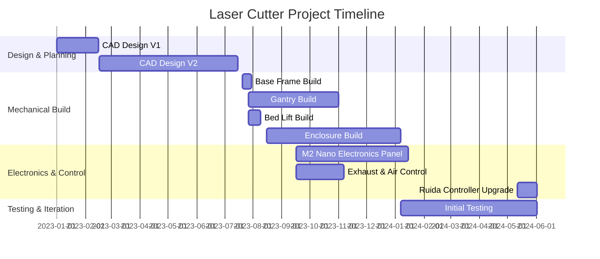

#! title: 1.0 - Minimum Viable Product
#! date: 6/29/2026
#! tags: K400, Laser Cutter, final, MVP, timeline, downloads, open source
#! description: The laser cutter project has reached a state of minimum viable product, and this article covers the final functionality, timeline, and open source files for the project.
#! author: Eli Bukoski
#! image: laser10/whole-laser.webp

# Minimum Viable Product

The term minimum viable product was coined in 2001 by Frank Robinson (according to Wikipedia), for a development style which releases the first functional version of the product to users, omitting quality of life features which may be added later. I personally dislike this strategy in its theoretical form. While mostly harmless in consumer software, the expansion of this ideology into other technology markets carries too significant a risk for me. If a phone app crashes or is buggy, no harm is done, but the same cannot be said in technology which has the capacity to injure, ie spaceflight, aviation, or a host of industrial machinery. However, it’s difficult to reconcile this stance with the fact that startups have limited resources. They may simply be unable to sustain the development cycle for a “more rigorous” design process. A buggy product will outperform one never released.

Regardless of these moral quandaries, the laser project needs to be designated as _finished_ sometime, and so I consider this state following the update to use a Ruida controller as the first time it’s functional enough to use for production. It’s definitely not perfect, and I want to continue to iterate on a custom motion controller, but especially the physical build is static.

## Final Functionality

As mentioned, the laser does not perform all functions as initially desired. The bed lift, or z axis, falls farthest from desired performance out of all the subsystems, but none are perfect. I’ve listed below some of the main performance goals I hoped for going into this project versus the current state.  
#% 1,2 

### Intended Functionality

- 24x48” cut volume  
- 600 mm/s raster  
- 40,000 mm/s^2 acceleration  
- 1000 dpi raster  
- Contactless auto-focus  
- Continuous focus compensation during operation  
- 12” Z depth  
- Direct K40 Whisperer & SVG dither support  
- Automatic peripheral control (air, exhaust)  
- 100% duty cycle operation (continuous runtime)  
- Safety interlock & E stop ability

#% 1,2

### Actual Functionality

- 22x45” cut volume  
- 400 mm/s raster  
- 2000 & 30,000 mm/s^2 acceleration (Y & X)  
- 1000 dpi raster  
- No Auto focus  
- 8” Z depth  
- No direct K40 Whisperer & SVG dither support  
- Automatic peripheral control (air, exhaust)  
- 100% duty cycle operation (continuous runtime)  
- Safety interlock & E stop ability

#%

The build and integration articles cover in detail why many of this design goals weren’t achieved, mostly just due to inexperience on my part. However, next I do want to cover two aspects not included in the build log: timeline and open source files.

### Timeline

Note I never cover the first CAD design, it was based on the motif of 3D printing monolithic multiple-function brackets, which I quickly realized was a poor design choice.

Also, the dates of article are publication dates, not the project timeline dates.

### Downloads

You can download the Inventor assembly (or OBJ) for the laser cutter build here:  
[Mech Downloads Page](/downloads/k400-mech)

I’ve also included the schematic files for wiring (of the M2 Nano setup) here:  
[Electronics Downloads Page](/downloads/k400-elec)

You can also get the code for the auxiliary micro-controller here:  
[Laser Aux- Github](https://github.com/Mapy542/Laser-Cutter-Auxiliary)

All files for the laser cutter project are free-open source, effectively MIT licensed, for any use open or not (I ask you avoid republishing, instead refer here). While the limitations of this design are well documented here, the mechanical build matches parody with the real build including some small changes documented during the integration article. The assembly designs may make a good jumping off point for you to refine if you choose to start here.

I look forward to continuing to iterate on the project, tackling the remaining issues and using it as a platform to develop a custom motion controller. I hope you’ve enjoyed reading about the project, and I look forward to hearing from you if you have any questions or comments.

Misc project images:
#!g

 {Second mirror}
 {40W tube mounted}
 {40W tube mounts on back beam}
 {40W tube mount}
 {80W close fit}
 {80W tube in laser}
 {80W tube mount}
 {80W tube next to 40W tube}
 {All subsystems assembled}
 {Attaching back frame beam}
 {Bad idler design}
 {Bed frame}
 {Completed bed lift}
 {Bed motor pulley}
 {Belt installed}
 {Large drag chain}
 {Broken bell crank pulley}
 {Chiller and dog}

 {Corner lead screw}
 {Cutting next panels}
 {Dirty electrical cabinet}
 {Finished door open view}
 {Double-cut linear rail}
 {Dovetail idler base}
 {Drag chain wires}
 {Electronics running}

 {Enclosure collision}
 {End stop}
 {Extrusion inner hole}

 {Finished gusset}
 {Finished laser head}
 {Flexible silicone tube}
 {Flow sensor}
 {Frame and panel integrated}
 {Frame build}
 {Frame half}
 {Gantry back}
 {Gantry legs}
 {Greased lead screw}
 {Gusset epoxy assembly}
 {Half bed lift and bed}
 {Hammered pulley block}
 {Head assembly}
 {Heat expansion pulley}
 {Inside bed lift motor assembly}
 {Integrated frames}
 {Integration of all subsystems}
 {Integration on base}
 {Linear rod on bed lift}
 {Mounted door panels}
 {Mounting hole}

 {Panel mount bracket}
 {Press-fit pulley}
 {Sides mounted}
 {TOF sensor placed}
 {Top-down view inside the laser}
 {X-axis stepper testing}
 {Y-axis motor mounted}
 {Y-axis drag chain wires}
 {Y-axis stepper wired}
#!g

[Next: 1.1 Re-designing the contactless focus](/K400-Updates/)
[Previous: 0.9 Integration](/K400-Updates/09-Integration)
[Back to Homepage](/k400-home)
